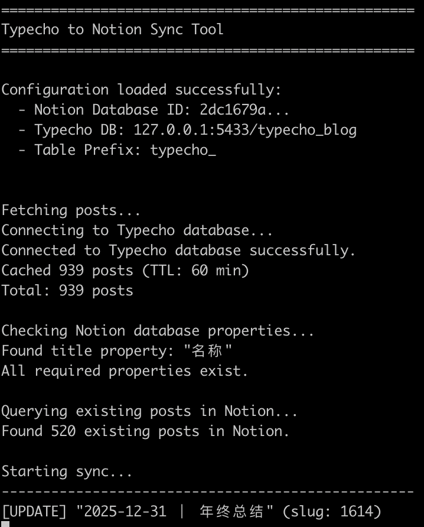

# Sync Typecho to Notion

将 Typecho 博客文章同步到 Notion 数据库，或导出为 Markdown 文件，或导出评论到 Remark42 的命令行工具。

A CLI tool to sync Typecho blog posts to Notion database, export as Markdown files, or export comments to Remark42.

## 功能 | Features

- 从 Typecho PostgreSQL 数据库读取文章 | Read posts from Typecho PostgreSQL database
- 同步标题、内容、分类、标签、发布状态到 Notion | Sync title, content, categories, tags, status to Notion
- **导出文章为 Markdown 文件（带 frontmatter）| Export posts as Markdown files with frontmatter**
- **导出到 Mix-Space BSON 格式 | Export to Mix-Space BSON format**
- **导出评论到 Remark42 备份格式 | Export comments to Remark42 backup format**
- **检查并移除失效的图片链接（可选）| Check and remove broken image links (optional)**
- 自动创建 Notion 数据库缺失的属性字段 | Auto-create missing Notion database properties
- 通过 slug 判断文章是否已存在，支持增量更新 | Incremental sync based on slug
- 比较修改时间，跳过未变更的文章 | Skip unmodified posts by comparing modification time
- 文章正文作为 Notion 页面内容（支持 Markdown）| Post content as Notion page body (Markdown supported)

## 效果预览 | Screenshot



## 安装 | Installation

```bash
npm install
```

## 配置 | Configuration

复制环境变量示例文件并编辑：

Copy and edit the environment variables file:

```bash
cp .env.example .env
```

配置项说明 | Configuration options:

| 变量 Variable | 说明 Description |
|---------------|------------------|
| `NOTION_KEY` | Notion Integration Token |
| `NOTION_DATABASE_ID` | 目标 Notion 数据库 ID / Target Notion database ID |
| `TYPECHO_DB_ADAPTER` | 数据库类型，目前仅支持 `postgresql` / Database type, only `postgresql` supported |
| `TYPECHO_DB_HOST` | 数据库主机地址 / Database host |
| `TYPECHO_DB_PORT` | 数据库端口 / Database port |
| `TYPECHO_DB_USER` | 数据库用户名 / Database username |
| `TYPECHO_DB_PASSWORD` | 数据库密码 / Database password |
| `TYPECHO_DB_DATABASE` | 数据库名称 / Database name |
| `TYPECHO_DB_PREFIX` | Typecho 表前缀，默认 `typecho_` / Table prefix, default `typecho_` |

**注意：** 导出 Markdown 功能不需要配置 Notion 相关环境变量。

**Note:** Markdown export doesn't require Notion environment variables.

## 使用 | Usage

### 同步到 Notion | Sync to Notion

```bash
# 开发模式运行 | Development mode
npm run dev

# 编译后运行 | Build and run
npm run build
npm start

# 跳过缓存 | Skip cache
npm run dev -- --no-cache

# 清除缓存 | Clear cache
npm run dev -- --clear-cache

# 检查图片链接（移除失效图片）| Check image links (remove broken images)
npm run dev -- --check-image-links
```

### 导出为 Markdown | Export as Markdown

将 Typecho 文章导出为 Markdown 文件，每个文章一个 `.md` 文件，文件名格式：`{year}-{month}-{day}-{slug}.md`

Export Typecho posts as Markdown files, one `.md` file per post, filename format: `{year}-{month}-{day}-{slug}.md`

**文件格式示例 | File Format Example:**

```markdown
---
title: "智能生活管家项目之一-系统简介"
postSlug: "1087"
category: "生活笔记"
created: "2018-12-04T02:30:00.000+00:00"
modified: "2024-11-20T08:44:00.000+00:00"
status: "publish"
tags: ["2018"]
---

文章内容...
```

**使用方法 | Usage:**

```bash
# 导出到默认目录 ./posts | Export to default directory ./posts
npm run dev -- markdown

# 或使用 export 命令 | Or use export command
npm run dev -- export

# 指定导出目录 | Specify export directory
npm run dev -- markdown --output-dir=/path/to/export
npm run dev -- markdown -o ./my-posts

# 跳过缓存 | Skip cache
npm run dev -- markdown --no-cache

# 组合使用 | Combined usage
npm run dev -- markdown -o ./blog/posts --no-cache

# 启用图片链接检查 | Enable image link checking
npm run dev -- markdown --check-image-links

# 完整示例 | Full example
npm run dev -- markdown -o ./posts --check-image-links --no-cache
```

**特性 | Features:**

- ✅ 自动创建导出目录 | Auto-create export directory
- ✅ 文件名格式：`YYYY-MM-DD-slug.md` | Filename format: `YYYY-MM-DD-slug.md`
- ✅ 包含完整 frontmatter 元数据 | Include complete frontmatter metadata
- ✅ 比较修改时间，智能更新 | Compare modification time, smart update
- ✅ 跳过未变更的文章 | Skip unmodified posts
- ✅ 可选图片链接检查 | Optional image link validation

### 图片链接检查 | Image Link Checking

使用 `--check-image-links` 参数启用图片链接检查功能。启用后，工具会检查文章中所有 `` 格式的图片链接，如果图片 URL 无法响应 200 状态码，将自动移除该图片语法。

Use `--check-image-links` parameter to enable image link checking. When enabled, the tool checks all `` image links in posts. If an image URL doesn't respond with 200 status code, the image syntax will be automatically removed.

**使用场景 | Use Cases:**
- 清理旧文章中失效的图片链接 | Clean broken image links in old posts
- 避免同步失效内容到 Notion | Avoid syncing broken content to Notion
- 保持导出的 Markdown 文件整洁 | Keep exported Markdown files clean

**性能优化 | Performance:**
- 超时时间：30 秒 | Timeout: 30 seconds
- 并发检查：最多同时检查 10 个图片 | Concurrent checks: up to 10 images at once
- 重定向支持：自动跟随 HTTP 重定向（301, 302, 307, 308），最多 3 次 | Redirect support: auto-follow HTTP redirects (301, 302, 307, 308), up to 3 times
- 大幅提升检查速度 | Significantly improved check speed

**注意 | Note:**
- 该功能默认关闭，需要显式启用 | This feature is disabled by default, must be explicitly enabled
- 并发检查加快处理速度，建议配合缓存使用 | Concurrent checking speeds up processing, recommend using with cache
- 自动跟随重定向，避免误判 301/302 为失效链接 | Auto-follow redirects to avoid false positives on 301/302
- 仅检查图片 URL 是否返回 200，不验证图片内容 | Only checks if URL returns 200, doesn't validate image content

### 导出评论到 Remark42 | Export Comments to Remark42

将 Typecho 评论导出为 Remark42 备份格式的 JSON 文件，可直接导入到 Remark42 评论系统。

Export Typecho comments to Remark42 backup format JSON file, which can be directly imported into Remark42 comment system.

**导出格式示例 | Export Format Example:**

```json
{"version":1,"users":[],"posts":[]}
{"id":"fa93c88b-e757-499e-866e-16ca49b087b0","pid":"","text":"<p>test</p>\n","orig":"test","user":{"name":"songtianlun","id":"anonymous_c311908b44c31caf06c29455d33dec2015f59119","picture":"https://remark42.frytea.com/api/v1/avatar/5c3d2dd7464439b511629d73e2bbd7df8471b4b8.image","ip":"6586f6e8eea7f1408f4afae13b8808da43e12905","admin":false,"site_id":"frytea.com"},"locator":{"site":"frytea.com","url":"https://frytea.com/about.html"},"score":1,"vote":0,"time":"2026-01-05T00:01:48.363159105+08:00","title":"关于 - Oskyla 烹茶室"}
```

**使用方法 | Usage:**

```bash
# 基本用法（必需参数）| Basic usage (required parameters)
npm run dev -- comments --site-id=frytea.com --site-url=https://frytea.com

# 指定输出文件 | Specify output file
npm run dev -- comments --site-id=frytea.com --site-url=https://frytea.com --output-file=./backup-frytea.json

# 使用短参数 | Use short parameters
npm run dev -- comments --site-id=frytea.com --site-url=https://frytea.com -f ./backup.json

# 跳过缓存 | Skip cache
npm run dev -- comments --site-id=frytea.com --site-url=https://frytea.com --no-cache

# 完整示例 | Full example
npm run dev -- comments --site-id=frytea.com --site-url=https://frytea.com -f ./backup-remark42.json --no-cache
```

**参数说明 | Parameters:**

- `--site-id` (必需/Required)：站点 ID，与 Remark42 配置保持一致 | Site ID, must match Remark42 configuration
- `--site-url` (必需/Required)：站点 URL，用于生成文章链接 | Site URL, used to generate post links
- `--output-file` 或 `-f` (可选/Optional)：输出文件路径，默认 `./backup-remark42.json` | Output file path, default `./backup-remark42.json`
- `--no-cache` (可选/Optional)：跳过缓存，重新从数据库获取数据 | Skip cache, fetch data from database

**特性 | Features:**

- ✅ 导出所有已审核通过的评论 | Export all approved comments
- ✅ 保留评论层级关系（回复）| Preserve comment hierarchy (replies)
- ✅ 自动生成 UUID 格式的评论 ID | Auto-generate UUID format comment IDs
- ✅ 生成 Gravatar 头像链接 | Generate Gravatar avatar links
- ✅ IP 地址哈希处理 | Hash IP addresses for privacy
- ✅ 与 Remark42 备份格式完全兼容 | Fully compatible with Remark42 backup format

**导入到 Remark42 | Import to Remark42:**

```bash
# 使用 remark42 命令导入备份文件
remark42 import -f ./backup-remark42.json -s frytea.com
```

### 导出到 Mix-Space | Export to Mix-Space

将 Typecho 文章、页面、分类和评论导出为 Mix-Space BSON 格式，可直接导入到 Mix-Space 博客系统的 MongoDB 数据库。

Export Typecho posts, pages, categories and comments to Mix-Space BSON format, which can be directly imported into Mix-Space blog system's MongoDB database.

**导出文件 | Output Files:**

```
mxspace-export/
├── categories.bson  # 分类数据 | Categories data
├── posts.bson       # 文章数据 | Posts data
├── pages.bson       # 页面数据 | Pages data
└── comments.bson    # 评论数据 | Comments data
```

**使用方法 | Usage:**

```bash
# 基本用法（导出到默认目录 ./mxspace-export）| Basic usage (export to default ./mxspace-export)
npm run dev -- mxspace

# 指定导出目录 | Specify export directory
npm run dev -- mxspace -o ./my-mxspace-export
npm run dev -- mxspace --output-dir=/path/to/export

# 跳过缓存 | Skip cache
npm run dev -- mxspace --no-cache

# 完整示例 | Full example
npm run dev -- mxspace -o ./mxspace-backup --no-cache
```

**特性 | Features:**

- ✅ 导出所有文章、页面、分类 | Export all posts, pages, categories
- ✅ 导出所有已审核评论 | Export all approved comments
- ✅ 保留评论层级关系 | Preserve comment hierarchy
- ✅ 自动生成 MongoDB ObjectId | Auto-generate MongoDB ObjectIds
- ✅ 提取文章中的图片信息 | Extract image information from posts
- ✅ 与 Mix-Space 数据格式完全兼容 | Fully compatible with Mix-Space data format

**导入到 Mix-Space | Import to Mix-Space:**

```bash
# 使用 mongorestore 导入 BSON 文件到 MongoDB
mongorestore --db=mx-space --collection=categories ./mxspace-export/categories.bson
mongorestore --db=mx-space --collection=posts ./mxspace-export/posts.bson
mongorestore --db=mx-space --collection=pages ./mxspace-export/pages.bson
mongorestore --db=mx-space --collection=comments ./mxspace-export/comments.bson
```


### 本地运行 | Local

```bash
# 开发模式运行 | Development mode
npm run dev

# 编译后运行 | Build and run
npm run build
npm start

# 跳过缓存 | Skip cache
npm run dev -- --no-cache

# 清除缓存 | Clear cache
npm run dev -- --clear-cache
```

### Docker

同步到 Notion | Sync to Notion:

```bash
# 使用环境变量运行 | Run with environment variables
docker run --rm \
  -e NOTION_KEY="secret_xxx" \
  -e NOTION_DATABASE_ID="your_database_id" \
  -e TYPECHO_DB_HOST="your_db_host" \
  -e TYPECHO_DB_PORT="5432" \
  -e TYPECHO_DB_USER="typecho" \
  -e TYPECHO_DB_PASSWORD="your_password" \
  -e TYPECHO_DB_DATABASE="typecho" \
  songtianlun/sync-typecho-to-notion

# 使用 env 文件运行 | Run with env file
docker run --rm --env-file .env songtianlun/sync-typecho-to-notion
```

导出为 Markdown | Export as Markdown:

```bash
# 导出文件到宿主机目录 | Export files to host directory
docker run --rm \
  --env-file .env \
  -v $(pwd)/posts:/app/posts \
  songtianlun/sync-typecho-to-notion markdown -o /app/posts
```

## 缓存 | Cache

为避免调试时频繁查询数据库，工具会将文章数据缓存到 `.cache/` 目录，默认有效期 1 小时。

To avoid frequent database queries during debugging, the tool caches post data in `.cache/` directory with 1-hour expiry.

- 缓存有效时自动使用 | Auto-use when cache is valid
- `--no-cache` 跳过缓存 | Skip cache
- `--clear-cache` 清除缓存 | Clear cache

## 高级功能 | Advanced Features

### 友链同步 | Links Sync (Handsome Theme)

支持同步 Handsome 主题的友链数据到 Notion 数据库。

Sync Handsome theme's links to a separate Notion database.

**配置 | Configuration:**

在 `.env` 中添加友链数据库 ID：

Add links database ID in `.env`:

```env
NOTION_LINKS_DATABASE_ID=your_links_database_id
```

**使用 | Usage:**

```bash
# 本地运行 | Local
npm run dev -- links

# Docker
docker run --rm --env-file .env songtianlun/sync-typecho-to-notion links
```

**友链数据库字段 | Links Database Fields:**

| 字段 Field | 类型 Type | 说明 Description |
|------------|-----------|------------------|
| Name | title | 友链名称 / Link name |
| URL | url | 链接地址，用于去重 / Link URL, for deduplication |
| Sort | select | 分类 / Category |
| Image | files | Logo 图片 / Logo image |
| Description | rich_text | 简介 / Description |

## 命令总览 | Commands Overview

```bash
# 同步文章到 Notion | Sync posts to Notion
npm run dev                                  # 默认命令 / Default command
npm run dev -- --no-cache                   # 跳过缓存 / Skip cache
npm run dev -- --clear-cache                # 清除缓存 / Clear cache
npm run dev -- --check-image-links          # 检查并移除失效图片 / Check and remove broken images

# 同步友链到 Notion | Sync links to Notion
npm run dev -- links

# 导出文章为 Markdown | Export posts as Markdown
npm run dev -- markdown                                    # 导出到默认目录 ./posts / Export to default ./posts
npm run dev -- export                                      # 同上 / Same as above
npm run dev -- markdown -o ./my-posts                      # 指定导出目录 / Specify directory
npm run dev -- markdown --output-dir=/path/to/export
npm run dev -- markdown --no-cache                         # 跳过缓存 / Skip cache
npm run dev -- markdown --check-image-links                # 检查并移除失效图片 / Check and remove broken images
npm run dev -- markdown -o ./blog --check-image-links      # 组合使用 / Combined

# 导出评论到 Remark42 | Export comments to Remark42
npm run dev -- comments --site-id=example.com --site-url=https://example.com           # 基本用法 / Basic usage
npm run dev -- comments --site-id=example.com --site-url=https://example.com -f ./backup.json   # 指定输出文件 / Specify output file
npm run dev -- comments --site-id=example.com --site-url=https://example.com --no-cache         # 跳过缓存 / Skip cache

# 导出到 Mix-Space | Export to Mix-Space
npm run dev -- mxspace                                                 # 导出到默认目录 ./mxspace-export / Export to default ./mxspace-export
npm run dev -- mxspace -o ./my-export                                  # 指定导出目录 / Specify directory
npm run dev -- mxspace --output-dir=/path/to/export
npm run dev -- mxspace --no-cache                                      # 跳过缓存 / Skip cache
```

## Notion 数据库字段 | Database Fields

同步时会自动创建以下字段（如不存在）：

The following fields will be auto-created if not exist:

| 字段 Field | 类型 Type | 说明 Description |
|------------|-----------|------------------|
| Title | title | 文章标题 / Post title |
| Slug | rich_text | 文章 slug，用于去重 / For deduplication |
| Category | multi_select | 分类 / Categories |
| Tags | multi_select | 标签 / Tags |
| Status | select | 发布状态 / Publish status |
| Created | date | 创建时间 / Creation time |
| Modified | date | 修改时间 / Modification time |

## 开发 | Development

```bash
# 安装依赖 | Install dependencies
npm install

# 开发模式 | Dev mode
npm run dev

# 编译 | Build
npm run build

# 构建 Docker 镜像 | Build Docker image
docker build -t sync-typecho-to-notion .
```

## License

MIT
